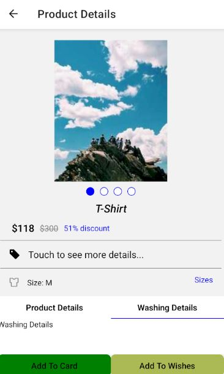

# A Basic E-Commerce Application

This is a basic E-Commerce Application that I have created and now I'm sharing it on GitHub. Let's go through the initial setup and take a look at some photos of the app.

## Initial Setup
1. Import Icon Packege
```json
/* package-local.json */
 "dependencies": {
        //...
        "react-native-screens": "^3.20.0",
        "react-native-vector-icons": "^9.2.0"
      },
```
Make sure to run npm install to install the package.

2. Run the application
```shell
npm run android
```
## Some Photos
1. 
1. 
1. 

